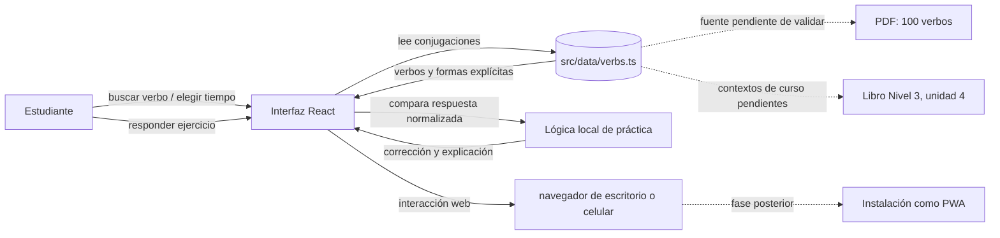
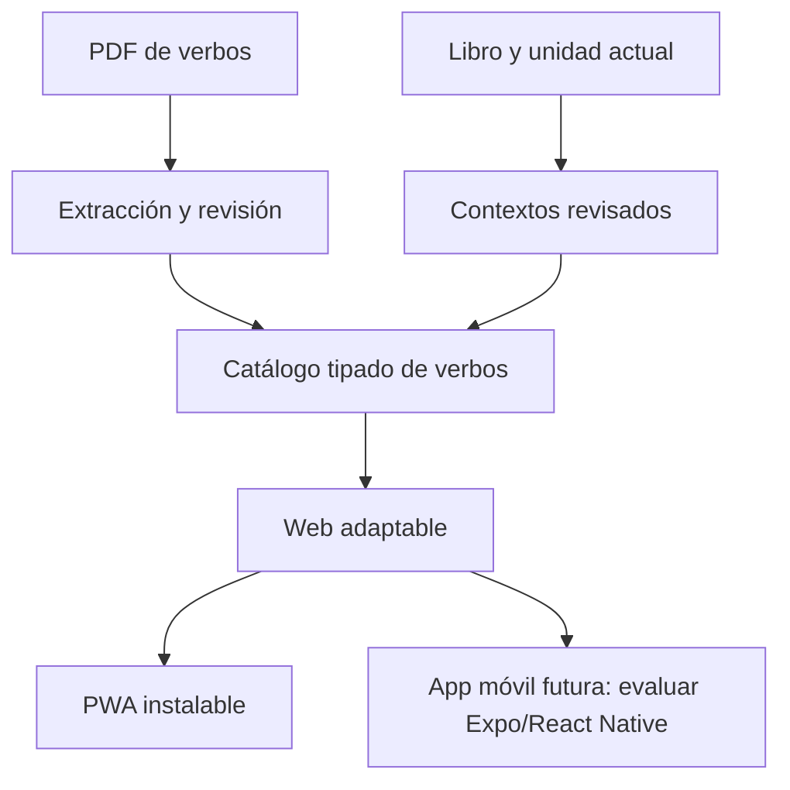

# Arquitectura y recorrido de la información

## Vista general

## Camino de consulta

1. El usuario escribe o selecciona un infinitivo.
2. La vista filtra el catálogo local de verbos.
3. La selección del tiempo obtiene las formas explícitas del verbo desde el módulo de datos.
4. La tabla presenta pronombres y formas, con `tu` como fila regional opcional.

## Camino de práctica

1. La vista selecciona una situación con contexto, verbo, persona y tiempo.
2. La frase se muestra con un espacio para completar.
3. La respuesta escrita se recorta y normaliza en mayúsculas/minúsculas y espacios.
4. La app compara con la respuesta esperada y presenta corrección y explicación guardadas con el ejercicio.

## Decisiones para la primera etapa

- React + TypeScript + Vite, sin API ni cuenta de usuario.
- El catálogo estático y los ejercicios viven en `src/data/verbs.ts`.
- No hay persistencia de progreso todavía; la consulta y los ejercicios funcionan en memoria.
- `public/manifest.webmanifest` prepara los metadatos de instalación. El service worker, el modo sin conexión y la persistencia local quedan para una iteración posterior.
- Las fuentes iniciales son PDFs compartidos por el usuario, pero sus datos deben extraerse y validarse antes de incorporarlos como catálogo.

## Evolución prevista

